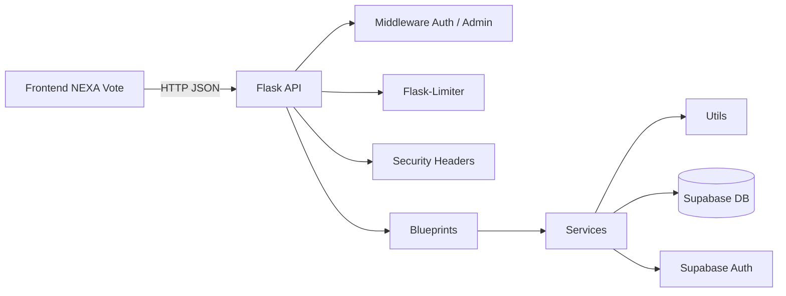
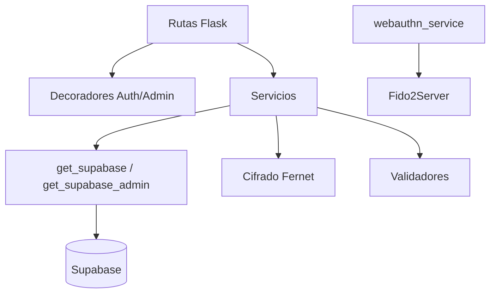

# Arquitectura del proyecto

NEXA Vote Back esta organizado como una API Flask con separacion por capas: rutas HTTP, servicios de negocio, middleware de seguridad y utilidades compartidas.

## Vista general

## Capas

| Capa | Ubicacion | Responsabilidad |
| --- | --- | --- |
| Entrada | `run.py` | Crea la app y levanta Flask localmente |
| Factory | `app/__init__.py` | Configura Flask, CORS, limiter, headers y blueprints |
| Rutas | `app/routes/*` | Define endpoints, lee requests y devuelve JSON |
| Middleware | `app/middleware/*` | Autorizacion, admin y headers de seguridad |
| Servicios | `app/services/*` | Logica de negocio, Supabase, WebAuthn, votos y reportes |
| Utilidades | `app/utils/*` | Cliente Supabase, cifrado y validadores |
| Extensiones | `app/extensions.py` | Instancia compartida de Flask-Limiter |

## Ciclo de arranque

1. `run.py` importa `create_app`.
2. `create_app()` instancia Flask.
3. Se inicializa `limiter`.
4. Se registra `security_headers` con `after_request`.
5. Se lee `ALLOWED_ORIGINS` y se configura CORS.
6. Se registran todos los blueprints.
7. La app queda lista para Flask local o Gunicorn.

## Blueprints registrados

| Blueprint | Archivo | Prefijo | Responsabilidad |
| --- | --- | --- | --- |
| Health/auth me | `app/__init__.py` | `/`, `/auth/me` | Salud y perfil autenticado |
| `registration_bp` | `app/routes/registration.py` | Sin prefijo | Registro y estado de votantes |
| `biometric_bp` | `app/routes/biometric.py` | Sin prefijo | Registro facial |
| `webauthn_bp` | `app/routes/webauthn.py` | Sin prefijo | Registro y autenticacion FIDO2 |
| `auth_bp` | `app/routes/auth.py` | `/api/auth` | Login de votantes |
| `mfa_bp` | `app/routes/mfa.py` | `/api/mfa` | MFA por DNI y rostro |
| `candidates_bp` | `app/routes/candidates.py` | `/api/votes` | Candidatos activos |
| `votes_bp` | `app/routes/votes.py` | `/api/votes` | Votos, resultados y reportes |
| `admin_bp` | `app/routes/admin.py` | `/api/admin` | Login admin |

## Seguridad

### Autorizacion de votante

`require_auth` valida `Authorization: Bearer <token>` con Supabase Auth, resuelve el votante por `auth_user_id` y guarda en `flask.g`:

- `g.voter_id`
- `g.auth_user_id`
- `g.session_token_hash`

### Autorizacion de administrador

`require_admin` valida el token y revisa que el usuario exista en `admins`. Si no existe, devuelve `403`.

### Rate limiting

`Flask-Limiter` usa la IP remota como clave. Rutas de registro, MFA, voto y WebAuthn tienen limites especificos.

### Headers de seguridad

`security_headers` agrega CSP basico, `nosniff` y `X-Frame-Options: DENY`.

## Cifrado

`app/utils/encryption.py` usa Fernet con una clave derivada de `VOTE_SECRET_KEY`. Se usa para guardar datos sensibles como credenciales WebAuthn y descriptores faciales cifrados.

## Flujo de dependencias

