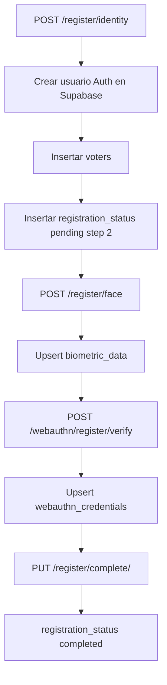
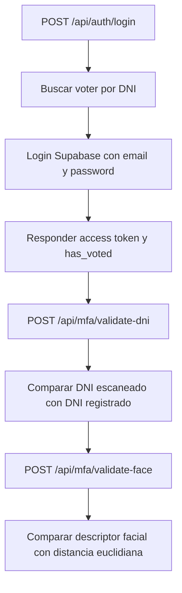
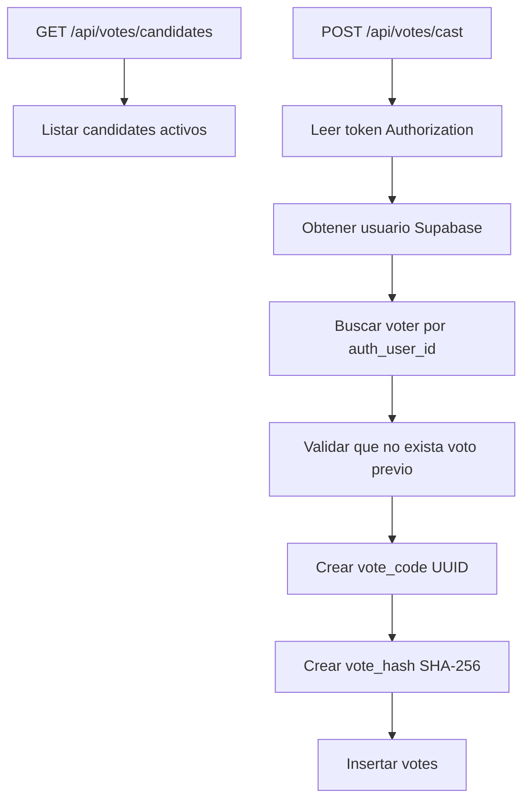

# Arquitectura del proyecto

NEXA Vote Back esta organizado como una API Flask con separacion simple por capas:

- `routes`: define endpoints HTTP, valida presencia minima de datos y transforma errores en respuestas JSON.
- `services`: contiene la logica de negocio y las llamadas a Supabase.
- `utils`: contiene clientes compartidos y validadores reutilizables.
- `run.py`: crea la aplicacion y la expone para ejecucion local o con Gunicorn.

## Ciclo de vida de la aplicacion

1. `run.py` importa `create_app` desde `app`.
2. `create_app` crea una instancia Flask.
3. Se configura CORS con `ALLOWED_ORIGINS`.
4. Se registra el endpoint de salud `GET /`.
5. Se registran todos los blueprints.
6. En ejecucion directa, Flask escucha en `0.0.0.0` y en el puerto definido por `PORT` o `10000`.

## Blueprints registrados

| Archivo | Blueprint | Prefijo | Responsabilidad |
| --- | --- | --- | --- |
| `app/routes/registration.py` | `registration` | Sin prefijo | Registro y consulta de votantes |
| `app/routes/biometric.py` | `biometric` | Sin prefijo | Registro de descriptor facial |
| `app/routes/webauthn.py` | `webauthn` | Sin prefijo | Registro y verificacion WebAuthn |
| `app/routes/auth.py` | `auth` | `/api/auth` | Login de votante |
| `app/routes/mfa.py` | `mfa` | `/api/mfa` | Validaciones multifactor |
| `app/routes/candidates.py` | `candidates` | `/api/votes` | Consulta de candidatos activos |
| `app/routes/votes.py` | `votes` | `/api/votes` | Votacion, resultados y participacion |
| `app/routes/admin.py` | `admin` | `/api/admin` | Login de administradores |

## Componentes por archivo

### `run.py`

Punto de entrada. Crea la aplicacion con `create_app()` y, si se ejecuta como script, inicia Flask en el puerto configurado. Tambien imprime mensajes de arranque utiles para depuracion.

### `app/__init__.py`

Construye la aplicacion Flask. Lee `ALLOWED_ORIGINS`, activa CORS y registra todas las rutas. Define `GET /` como health check.

### `app/config.py`

Carga variables de entorno con `load_dotenv()` y expone `SUPABASE_URL`, `SUPABASE_KEY` y `SUPABASE_SERVICE_ROLE_KEY` mediante la clase `Config`.

### `app/utils/supabase_client.py`

Crea clientes Supabase bajo demanda:

- `get_supabase()`: cliente con `SUPABASE_KEY`, usado para operaciones normales y autenticacion de usuario.
- `get_supabase_admin()`: cliente con `SUPABASE_SERVICE_ROLE_KEY`, usado para operaciones administrativas.

Ambos clientes se mantienen en variables globales para reutilizar la instancia.

### `app/utils/validators.py`

Contiene `validate_identity(data)`, que valida:

- `dni` obligatorio, numerico y de 8 digitos.
- `full_name` obligatorio, de 3 a 100 caracteres y solo letras/espacios.
- `birth_date` obligatorio en formato `YYYY-MM-DD`.
- `email` obligatorio con formato basico valido.
- Edad minima de 18 anos.
- Edad maxima de 100 anos.

## Flujo de registro

Tambien existe un flujo alternativo `POST /register/identity/scan`, que crea un votante parcial desde datos escaneados de DNI con `registration_step = 1`.

## Flujo de login y MFA

## Flujo de votacion

## Seguridad y permisos

- El backend usa `SUPABASE_SERVICE_ROLE_KEY` para crear usuarios, leer tablas protegidas e insertar registros administrativos.
- La validacion de votante autenticado se hace leyendo el token `Authorization: Bearer <token>`.
- El sistema evita doble voto consultando si ya existe un registro en `votes` para el mismo `voter_id`.
- El voto guarda `vote_code` y `vote_hash`, pero el voto no es anonimo a nivel de tabla porque `votes` conserva `voter_id`.

## Dependencias externas

- Supabase Auth para login de votante y administrador.
- Supabase Database para persistencia.
- NumPy para distancia facial.
- Flask-CORS para permitir consumo desde frontend.
