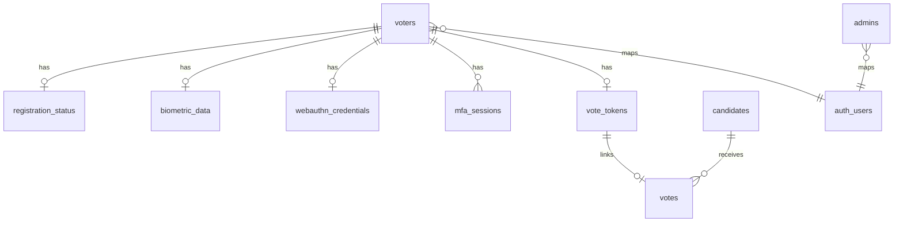

# Modelo de datos esperado en Supabase

El repositorio no incluye migraciones SQL. Este documento describe el esquema inferido desde el codigo de `main`.

## Resumen de tablas

| Tabla | Proposito |
| --- | --- |
| `voters` | Identidad del votante |
| `registration_status` | Estado de avance del registro |
| `biometric_data` | Descriptor facial del votante |
| `webauthn_credentials` | Credenciales WebAuthn/FIDO2 |
| `mfa_sessions` | Validaciones MFA por sesion JWT |
| `vote_tokens` | Control de voto emitido por votante |
| `votes` | Voto anonimizando parcialmente con hash/token |
| `candidates` | Candidatos activos e informacion publica |
| `admins` | Usuarios administrativos autorizados |
| `audit_logs` | Auditoria de acciones |

## `voters`

| Campo | Tipo esperado | Uso |
| --- | --- | --- |
| `id` | UUID | Identificador principal |
| `dni` | Texto | Login y validacion MFA |
| `full_name` | Texto | Identidad |
| `birth_date` | Fecha/texto `YYYY-MM-DD` | Validacion y reportes por edad |
| `email` | Texto | Login Supabase Auth |
| `auth_user_id` | UUID | Relacion con Supabase Auth |
| `registration_step` | Entero | Paso visible del registro |

Recomendado: `dni`, `email` y `auth_user_id` unicos cuando no sean null.

## `registration_status`

| Campo | Tipo esperado | Uso |
| --- | --- | --- |
| `id` | UUID/autogenerado | Identificador |
| `voter_id` | UUID | Relacion con `voters.id` |
| `current_step` | Entero | Paso actual |
| `status` | Texto | Estado textual |

Estados usados:

- `pending`
- `completed`

Pasos usados:

- `1`: identidad parcial por escaneo.
- `2`: identidad completa creada.
- `4`: registro completado.

## `biometric_data`

| Campo | Tipo esperado | Uso |
| --- | --- | --- |
| `id` | UUID/autogenerado | Identificador |
| `voter_id` | UUID | Relacion con votante |
| `face_embedding` | JSON/texto cifrado | Descriptor facial |

El servicio MFA soporta datos cifrados con Fernet y datos legados en texto plano. Para comparacion facial se espera vector de 128 numeros.

## `webauthn_credentials`

| Campo | Tipo esperado | Uso |
| --- | --- | --- |
| `id` | UUID/autogenerado | Identificador |
| `voter_id` | UUID | Relacion con votante |
| `credential_raw` | Texto cifrado | `AttestedCredentialData` codificado y cifrado |
| `credential_id` | Texto | ID websafe de credencial |
| `public_key` | Texto | Public key CBOR codificada |
| `sign_count` | Entero | Contador de autenticador |

Recomendado: `voter_id` unico para mantener un registro WebAuthn principal por votante.

## `mfa_sessions`

| Campo | Tipo esperado | Uso |
| --- | --- | --- |
| `id` | UUID/autogenerado | Identificador |
| `voter_id` | UUID | Votante autenticado |
| `session_token_hash` | Texto SHA-256 | Hash del JWT de sesion |
| `dni_validated` | Boolean | DNI validado |
| `face_validated` | Boolean | Rostro validado |
| `webauthn_validated` | Boolean | WebAuthn validado |

Se crea durante login de votante. El voto solo se permite si los tres flags estan en `true` para el token actual.

## `vote_tokens`

| Campo | Tipo esperado | Uso |
| --- | --- | --- |
| `id` | UUID/autogenerado | Identificador |
| `voter_id` | UUID | Control de doble voto |
| `token` | Texto UUID | Token interno aleatorio |

Recomendado: constraint unico en `voter_id` para impedir doble voto a nivel base de datos.

## `votes`

| Campo | Tipo esperado | Uso |
| --- | --- | --- |
| `id` | UUID/autogenerado | Identificador |
| `token_hash` | Texto SHA-256 | Hash de token + secreto |
| `candidate_id` | UUID/null | Candidato o null para voto blanco |
| `vote_code` | Texto UUID | Codigo aleatorio del voto |
| `vote_hash` | Texto SHA-256 | Hash de token + candidate_id + secreto |

A diferencia de la version inicial, `votes` ya no guarda directamente `voter_id`; el control de votante queda en `vote_tokens`.

## `candidates`

| Campo | Tipo esperado | Uso |
| --- | --- | --- |
| `id` | UUID | Identificador |
| `name` | Texto | Nombre del candidato |
| `party` | Texto | Partido politico, usado en reportes |
| `photo_url` | Texto | Foto |
| `is_active` | Boolean | Filtro de candidatos activos |

## `admins`

| Campo | Tipo esperado | Uso |
| --- | --- | --- |
| `id` | UUID | Identificador admin |
| `auth_user_id` | UUID | Usuario Supabase Auth autorizado como admin |

## `audit_logs`

| Campo | Tipo esperado | Uso |
| --- | --- | --- |
| `id` | UUID/autogenerado | Identificador |
| `voter_id` | UUID/null | Votante relacionado |
| `action_type` | Texto | Tipo de accion |
| `status` | Texto | Estado de la accion |
| `ip_address` | Texto | IP remota |
| `metadata` | JSON | Informacion adicional |

## Relaciones recomendadas

## Restricciones recomendadas

- `voters.dni` unico.
- `voters.email` unico cuando no sea null.
- `voters.auth_user_id` unico cuando no sea null.
- `registration_status.voter_id` unico.
- `biometric_data.voter_id` unico.
- `webauthn_credentials.voter_id` unico.
- `vote_tokens.voter_id` unico.
- Indice en `mfa_sessions(voter_id, session_token_hash)`.
- Indice en `votes(candidate_id)`.
