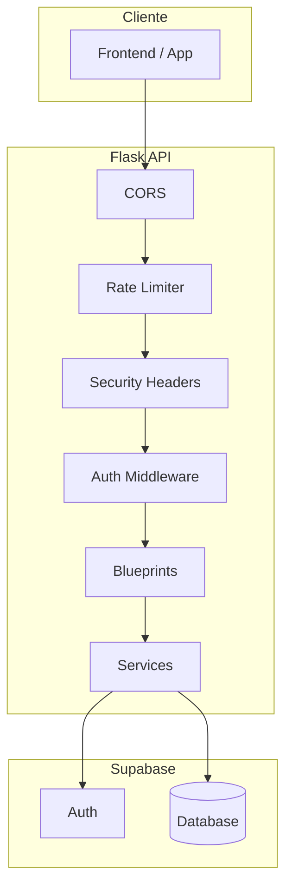
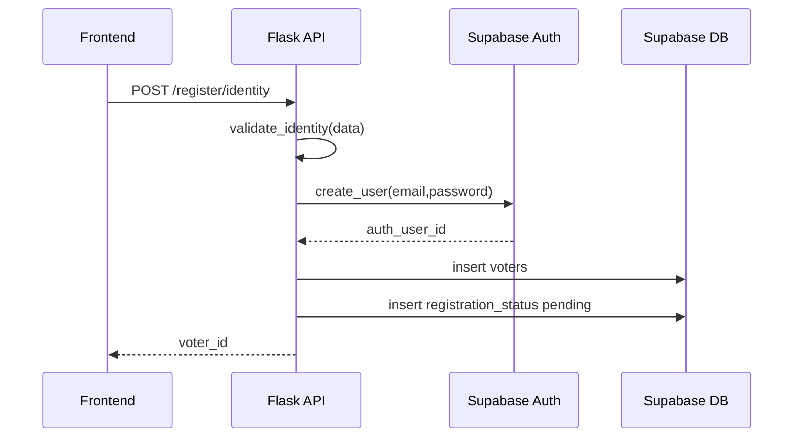
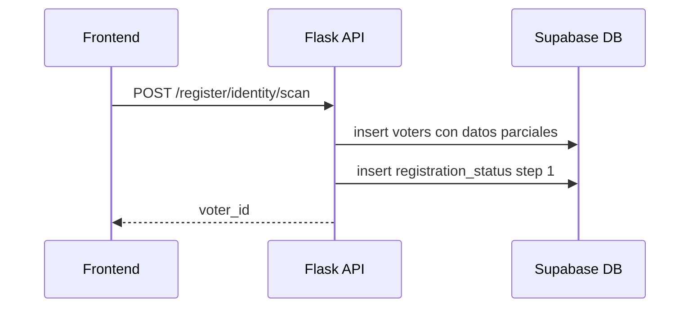
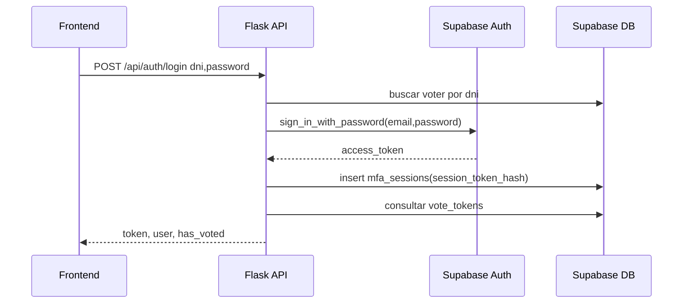
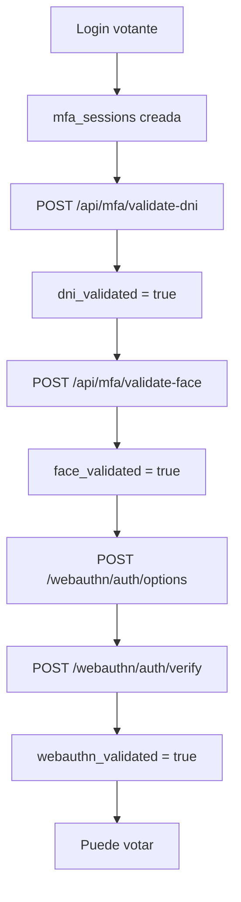
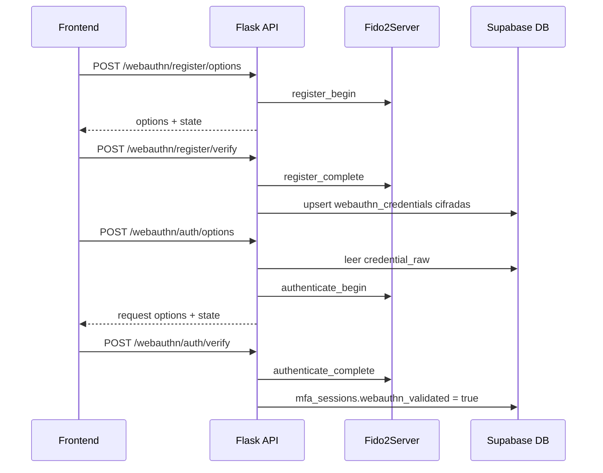
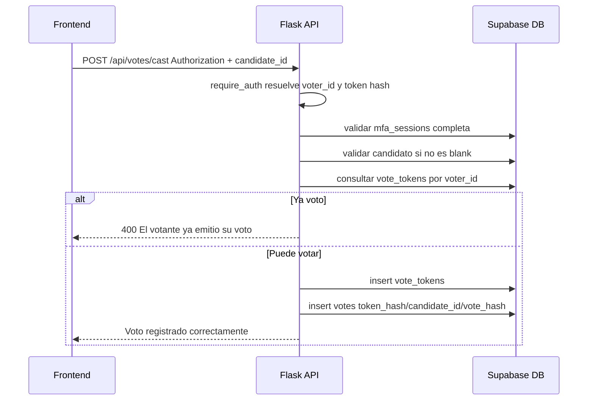
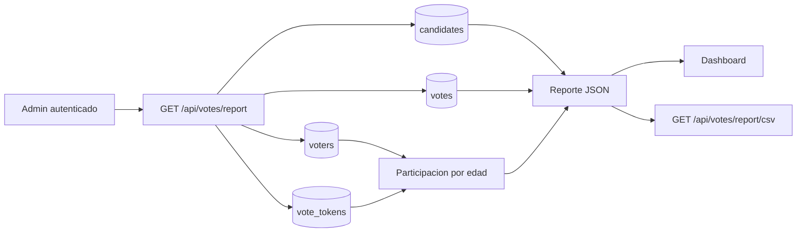
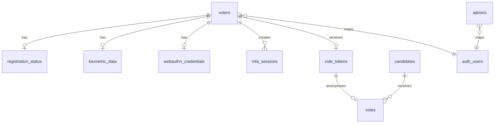

# Diagramas y flujos del sistema

Este archivo concentra los graficos Mermaid para entender el backend, sus flujos y sus dependencias.

## Arquitectura general

## Registro de votante

## Registro por escaneo de DNI

## Login y creacion de sesion MFA

## MFA completo antes de votar

## WebAuthn registro y autenticacion

## Emision de voto

## Reportes electorales

## Modelo relacional inferido

